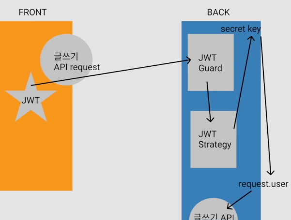

# Gomunity(Cat-community) 

- 고양이 커뮤니티를 만듭니다

## 1.Function
- 유저
  - 로그인
  - 회원가입
- 게시글
  - 게시글 작성
    - 이미지 업로드
  - 게시글 수정
  - 게시글 삭제
  - 게시글 조회

## 2.Stack

- NestJS
  - MonoRepo
- MongoDB
- Mongoose
- API Docs (Swagger)
  - express-basic-auth
- Passport (JWT)
- package
  - @nestjs/config
  - class-validator
  - bcrpyt, @types/bcrtypt
  - swagger
  - passport
  - milter
  - nest multer extended
    - nest version 7에서만 적용되므로 pass
  - aws-sdk
    - S3이미지 업로드 모듈 사용

## 2.1.Mongooes설치
```bash
npm install --save @nestjs/mongoose mongoose
```

## 2.2 Class-Vlidator설치
```bash
npm i --save class-validator class-transformer 
```

## 2.3. Bcrypt설치
```bash
npm i --save bcrypt @types/bcrypt
```

## 2.4. Swagger설치
```bash
npm i --save @nestjs/swagger swagger-ui-express
```

## 2.5. Passport설치
```bash
npm i --save @nestjs/passport passport @nestjs/jwt passport-jwt
npm i --save-dev @types/passport-jwt
``` 


## 2.6. express-basic-auth설치
```bash
npm i express-basic-auth
```

## 2.7. multer설치
```bash
npm i --save @types/multer
```

## 2.8. nest multer extended설치
```bash
npm i --save nestjs-multer-extended
```

## 2.9. aws-sdk설치
```bash
npm i --save aws-sdk
```

## 3.오류

### 3.1.[문제] Monorepo를 사용하기위한 커맨드가 작동하지않음
```bash
nest generate app auth
```
### 3.1.[해결] npx를 반드시 붙여줘야한다.
```bash
npx nest generate app auth
```

### 3.2.[문제] DB접속문제
```bash
WARNING: MongoDB 5.0+ requires a CPU with AVX support, and your current system does not appear to have that!
  see https://jira.mongodb.org/browse/SERVER-54407
  see also https://www.mongodb.com/community/forums/t/mongodb-5-0-cpu-intel-g4650-compatibility/116610/2
  see also https://github.com/docker-library/mongo/issues/485#issuecomment-891991814
```

### 3.2.[해결] CPU사양문제
- CPU가 AVX를 지원하지않아서 발생하는 문제
- 4.4버전으로 다운그레이드


### 3.3 [문제]
```bash
command listDatabases requires authentication
```

### 3.3 [해결]
- mongoDB에 접속하기위해서는 인증이 필요하다
- mongoDB에 접속하기위한 계정을 생성해야한다

### 3.4. [문제]
```typescript
    MongooseModule.forRoot(process.env.DATABASE_URL, {
      useNewUrlParser: true,
      useUnifiedTopology: true,
      useCreateIndex: true,
      useFindAndModify: false,
    }),
```
- 위와같이 설정하면 아래와같은 오류가 발생한다
```bash
Argument of type '{ useNewUrlParser: boolean; useUnifiedTopology: boolean; useCreateIndex: boolean; useFindAndModify: boolean; }' is not assignable to parameter of type 'MongooseModuleOptions'.
```


### 3.4. [해결]

- 아래의것들을 사용하지않는다.
    useNewUrlParser: true,
    useUnifiedTopology: true,
    useCreateIndex: true,
    useFindAndModify: false,
- 아래의 링크를 참고한다
- https://www.mongodb.com/community/forums/t/argument-of-type-usenewurlparser-boolean-useunifiedtopology-boolean-is-not-assignable-to-parameter-of-type/169033/3
- https://velog.io/@untiring_dev/MongoDB-MongoDB-Mongoose%EC%97%90-%EC%97%B0%EA%B2%B0

### 3.5. [문제]
- MongoDB Connection 오류
```bash
[Nest] 17078  - 12/05/2023, 5:01:24 PM   ERROR [MongooseModule] Unable to connect to the database. Retrying (1)...
MongoServerError: Authentication failed. 
```
- MongoDB에는 접속했어도 DB접근권한이없으면 접근할수없다

### 3.5. [해결]
- MongoDB에 접속하기위한 계정을 생성해야한다
- 아래의 링크를 참고한다
- https://www.mongodb.com/docs/v3.2/tutorial/enable-authentication/

### 3.6. [문제]
```bash
Command failed with error 31 (RoleNotFound): 'Cannot grant nonexistent role createIndex@mymongo' on server localhost:27017. The full response is {"ok": 0.0, "errmsg": "Cannot grant nonexistent role createIndex@mymongo", "code": 31, "codeName": "RoleNotFound"}
```
- MongoDB Role 생성 중 발생하는 오류
- 3.5.에서 생성한 계정에게 권한을 부여할때 발생함

### 3.6. [해결]
- readWriteAnyDatabase role은 왜인지 4.4에서는 사용할수없다
- readWrite role을 사용하면된다
```json
use mymongo
db.createUser(
    {
        user: "{{user_name}}",
        pwd: "{{password}}",
        roles: [ { role: "readWrite", db: "{{db_name}}" }]
    }
)
```

### 3.7 [문제]
- nestjs JsonWebTokenError: jwt must be a string 출력

### 3.7 [해결]
- jwtFromRequest: ExtractJwt.fromAuthHeaderAsBearerToken()를
- jwtFromRequest: ExtractJwt.fromAuthHeaderAsBearerToken로 적었기때문에 발생한 문제..
  - 정말멍청했지만.. Passport와 Strategy, Guard를 리버스엔지니어링하면서 많은것을 배운듯..
  - 이 경우에는 token추출 시 String이 아니라 Function으로 반환되어 발생한 문제이다.

### 3.8 [문제]
- express-basic-auth 오류
```bash
TypeError: (0 , express_basic_auth_1.default) is not a function
```

### 3.8 [해결]
```json
// tsconfig.json
{
 "esModuleInterop": true
}
```
- 그 외에, app설정 코드 내에서 Swwagger설정보다 상단에 위치해야한다.